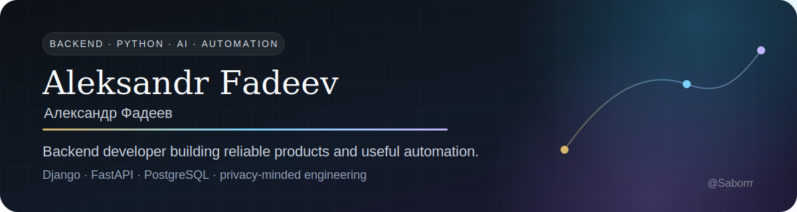

### Backend-разработчик · Python · Django · FastAPI · PostgreSQL

## Привет! Я Александр Фадеев 👋

Я **backend-разработчик**. Проектирую API и бизнес-логику на Python, работаю с
Django, Django REST Framework и FastAPI, храню данные в PostgreSQL и упаковываю
приложения в Docker. Мне интересны задачи, где недостаточно просто написать
код: нужно разобраться в предметной области, защитить данные, автоматизировать
повторяющиеся операции и довести результат до устойчивого запуска.

Сейчас мой фокус — backend-сервисы, privacy-first автоматизация с применением
LLM, кроссплатформенные приложения и внутренние инструменты, которые заменяют
повторяющуюся ручную работу.

## Избранные проекты

<table>
<tr>
<td width="50%" valign="top">

### 🧠 [Psycho Portrait](https://github.com/Saborrr/psycho-portrait)

Пакетная обработка результатов психологических тестов: PPTX/PDF → проверяемая
характеристика → Excel. Обезличивание перед LLM, защищённая история и контроль
качества итогового текста.

`Python` `FastAPI` `PWA` `LLM` `Excel` `Privacy`

</td>
<td width="50%" valign="top">

### 🖼️ [Museum at Home](https://github.com/Saborrr/museum-at-home)

Домашняя художественная галерея для LG webOS 3+, Android TV, Fire TV, Samsung
Tizen и браузера. 55 проверенных работ, офлайн-каталог, управление пультом и
автоматические сборки для нескольких платформ.

`JavaScript ES5` `Kotlin` `Android TV` `webOS` `Tizen` `PWA`

</td>
</tr>
<tr>
<td width="100%" colspan="2" valign="top">

### 🏆 [LRA-26](https://github.com/Saborrr/lra26)

Live-лидерборд команд с WebSocket-обновлениями, кабинетом тренера,
Telegram-ботом, JWT-авторизацией и контейнеризованным развёртыванием.

`Django` `DRF` `Channels` `React` `TypeScript` `Docker`

</td>
</tr>
</table>

## Технологии

### Backend и API

  
  
  
  

### Базы данных и асинхронность

  
  
  

### Инфраструктура и доставка

  
  
  
  

### Дополнительно

  
  
  
  

## Как я подхожу к разработке

- **Сначала рабочий сценарий.** Интерфейс и архитектура должны помогать человеку завершить задачу.
- **Безопасность по умолчанию.** Секреты, персональные данные и внешние API проектируются как отдельная зона риска.
- **Автоматизация вместо рутины.** Тесты, проверки данных, сборки и выпуск артефактов должны воспроизводиться одной командой.
- **Честная документация.** README объясняет не только возможности, но и ограничения продукта.

<strong>English summary</strong>

I am a backend developer working with Python, Django, Django REST Framework,
FastAPI and PostgreSQL. I build API-driven products, privacy-first AI workflows,
cross-platform applications and internal tools that replace repetitive manual
work. I care about data protection, maintainable business logic, reproducible
deployments and documentation that states limitations as clearly as features.

---

<i>Useful software is not only code that runs — it is a workflow people can trust.</i>

